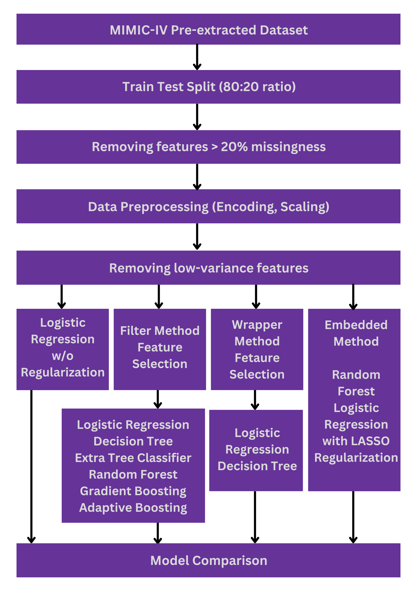
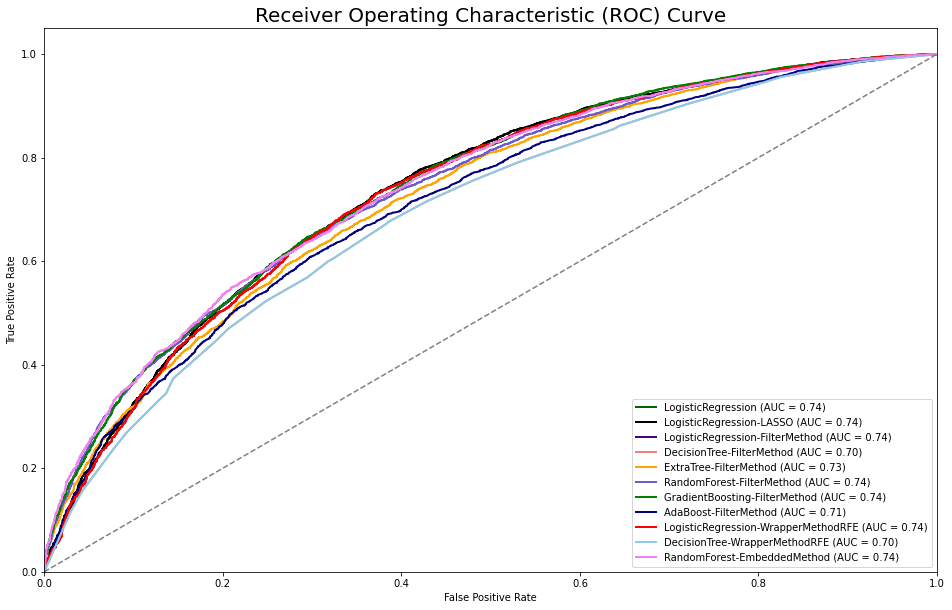

## Kidney Failure Risk Prediction in Intensive Care Unit (ICU) Patients

***

In this individual project for the course SPH6004 Advanced Statistical Learning, I developed a strategy to select the optimal combination of features for predicting the risk of kidney failure in ICU patients using real-world Electronic Medical Record (EMR) data from the MIMIC-IV database. The process involved inspecting the dataset for duplicate records and missing values, followed by data preprocessing steps such as encoding, scaling, and imputation. I trained predictive models using various machine learning algorithms, including tree-based methods and boosting algorithms. To achieve optimal model performance, I applied several feature selection techniques, including filter methods, embedded methods, and wrapper methods like recursive feature elimination, stepwise feature selection, and genetic algorithms. 11 models were trained using various feature subsets with different learning algorithms. With the project's goal being the construction of a model capable of accurately estimating the likelihood of ICU patients developing AKI, a preference was given to models exhibiting high average precision. Notably, all models demonstrated comparable AUC (ranging from 0.694 to 0.739) and average precision scores (ranging from 0.801 to 0.847).

### Table of Content

1. Part 1 - Data Loading & Understanding
   * 1.1 Import Essential Libraries
   * 1.2 Load the Dataset and Basic Dataset Understanding
   * 1.3 Duplicate Record Inspection
   * 1.4 Train Test Split
   * 1.5 Class Distribution in Target Variable
   * 1.6 Missing Value Inspection
2. Part 2 - Data Preprocessing
   * 2.1 Re-categorization of Variable Race
   * 2.2 Feature Engineering (Encoding, Scaling, Imputation)
   * 2.3 Correlation Analysis
   * 2.4 Variance Inflation Factor (VIF) Analysis
   * 2.5 Variance Analysis
3. Part 3 - Model Training
   * 3.1 Sampling a Training Subset
   * 3.2 Base Model
   * 3.3 Feature Selection Method 1 - Filter Method
   * 3.4 Feature Selection Method 2 - Wrapper Method
   * 3.5 Feature Selection Method 3 - Embedded Method
   * 3.6 Comparison of Model Performances

### Overview of Analysis Workflow

### Model Performance on Test Data

| Model                           | AUROC | Average Precision | Precision | Recall | F1 Score | False Positive Rate |
|---------------------------------|-------|-------------------|-----------|--------|----------|---------------------|
| LogisticRegression              | 0.739 | 0.832             | 0.812     | 0.658  | 0.678    | 0.308               |
| LogisticRegression-LASSO        | 0.739 | 0.832             | 0.811     | 0.657  | 0.678    | 0.309               |
| LogisticRegression-FilterMethod | 0.735 | 0.828             | 0.811     | 0.657  | 0.677    | 0.310               |
| DecisionTree-FilterMethod       | 0.696 | 0.802             | 0.780     | 0.671  | 0.662    | 0.382               |
| ExtraTree-FilterMethod          | 0.725 | 0.832             | 0.801     | 0.645  | 0.665    | 0.323               |
| RandomForest-FilterMethod       | 0.738 | 0.842             | 0.792     | 0.722  | 0.693    | 0.384               |
| GradientBoosting-FilterMethod   | 0.744 | 0.845             | 0.744     | 0.908  | 0.704    | 0.632               |
| AdaBoost-FilterMethod           | 0.712 | 0.820             | 0.732     | 0.881  | 0.680    | 0.652               |
| LogisticRegression-RFE          | 0.731 | 0.824             | 0.809     | 0.654  | 0.675    | 0.313               |
| DecisionTree-RFE                | 0.694 | 0.801             | 0.782     | 0.643  | 0.651    | 0.362               |
| RandomForest-EmbeddedMethod     | 0.743 | 0.847             | 0.791     | 0.736  | 0.698    | 0.394               |

### Receiver operating characteristic (ROC) Curve

